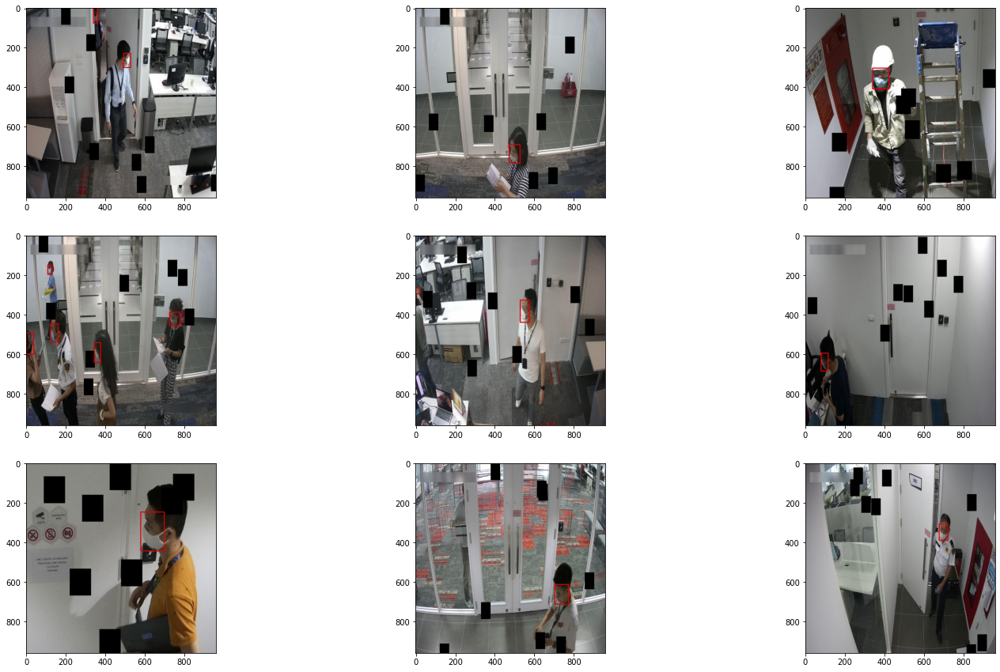
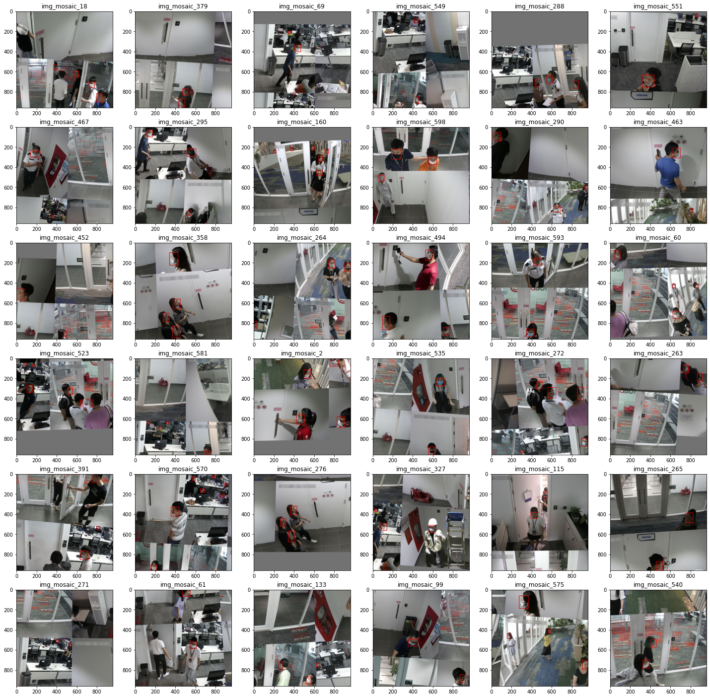
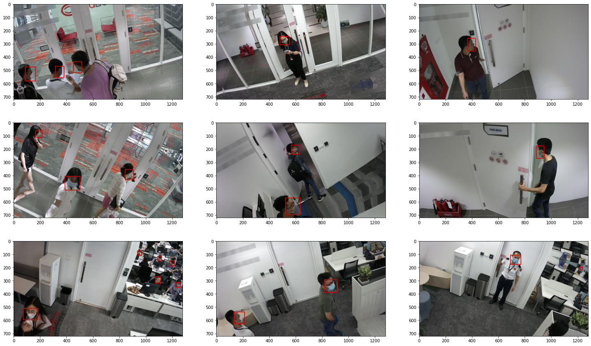
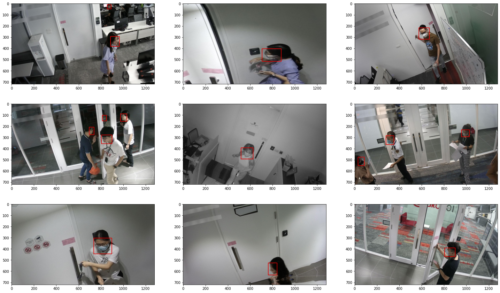

# FPT data centric competition (Top 20/400)

## Introduction
Deep Learning models have become exceedingly developed and popular in recent years. On the other hand, data processing techniques have not been equally developed compared to models

In this competition, participants are provided with a dataset. The goal is to use processing techniques on that dataset to ensure that model achieves the best performance after training.

Following Reinforcement Learning Competition 2021 success, DataComp is a brand new competition with a new approach for researchers. Besides that, DataComp was created to contribute to the prevention of Covid-19 pandemic, using face mask recognition model.
- Competition link: https://datacomp.io/gioi-thieu

## Our performance
- **Achieve top 20/400 teams (5% highest team)** having the highest score validated on the private test dataset
- Our wAP@0.5 score on private test: **0.545**
- Team name: "nan"
- Leaderboard link: https://datacomp.io/bang-xep-hang-cuoi-cung 

## Github construction
- [Albumentation folder](https://github.com/HarryPham0123/FPT_data_centric_competition/tree/main/Augmentation_visualization): folder contains notebook visualization of dataset applied Albumentation library & notebook to create & save those augmented images into a specific folder
- [KNN folder](https://github.com/HarryPham0123/FPT_data_centric_competition/tree/main/KNN_application): folder contained notebook applying KNN technique to cluster the set of images into a specific upnique group with the same characteristic
- [Mosaic folder](https://github.com/HarryPham0123/FPT_data_centric_competition/tree/main/Mosaic_augmentation): contain the notebook to construct & visualize the mosaic images augmentation
- [main](https://github.com/HarryPham0123/FPT_data_centric_competition/tree/main/main): folder contained notebook to do the experiment with different types of augmentation to conduct the below final augmented combination
- [Utils notebook](https://github.com/HarryPham0123/FPT_data_centric_competition/blob/main/Utils.ipynb): a notebook contained all the functions relating to copy, delete, transfer images & labels from a folder to another folder in Google Drive cloud

## Methods
We tried many different data augmentation from the basic types such as rotation, shearing, ... to some quite advance techniques such as mosaic, random safe crop,... The library that we're using [`albumentation`](https://albumentations.ai/)

Consequently, the combination of these below technqiues result to the final highest score in our case:
- **Train dataset** -> `934 images` after relabeled to make sure the correctness is more than 99%  
- **Validation dataset** -> `154 images` (design an as much as general set by ultilizing KNN technique which is explained below!)
- **toGray augmentation** -> `100 images`
- **CutOut + HorizontalFlip (p=0.5)** -> `400 images`

- Filter only **incorrect-mask label images + HorizontalFlip (p=0.7)** -> `200 images`
 - **Mosaic augmentation** -> `451 images`
(Note: after do the mosaic augmentation, it's crucial to check the set again to exclude all images having poor-quality bboxes at the edge of each image)

- **Rotation + Shear** (prob 50/50) -> `600 images`
  - **Rotation + Shear** (prob 50/50) with no-mask & mask only -> `200 images`

  - Remaining images augmented normally -> `400 images`

- B.c model perform poorly with images having people appeared behide the door. Therefore, filter & augment specificailly those images in training dataset -> `100 images`

--> `TOTAL 2939 augmentation images` to submit (training + validation)

## KNN ultilization ([KNN folder](https://github.com/HarryPham0123/FPT_data_centric_competition/tree/main/KNN_application))
1. Briefly instroduce about KNN
2. The application of KNN in our solution
- Used to construct as general as possible validation dataset
- Categorize type of images in training set to faster filter images with specific feature, characteristic (Ex: Img having people behide doors, img having people wearing different types of masks)
