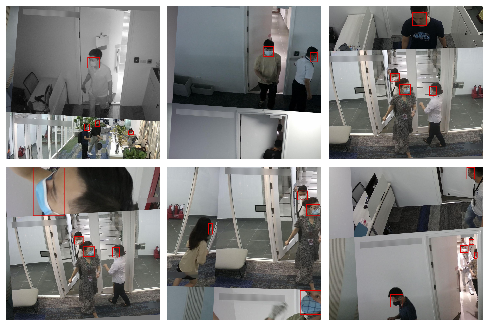

# Data Augmentation Mosaic Albumentation (YOLO format)
This repository contributes the code to construct, visualize and save augmented images, namely Mosaic, CutOut, Random Crop (keep bbox safe), Shearing, Rotation, etc. by using `Albumentation` and `Mosaic` implementation

## Prerequisite
Please change the path in the 1st cell of each notebook to path in your local computer

## Folder `notebooks` contains
- [Mosaic_Augmentation.ipynb](https://github.com/HarryPham0123/FPT_data_centric_competition/tree/main/Augmentation_visualization): construct, visualize and save mosaic images base on `dataset` folder
- [Albumentation_Visualization.ipynb](https://github.com/HarryPham0123/FPT_data_centric_competition/tree/main/KNN_application): Apply, visualize multiple augmentation techniques, such as Random Crop (keep bbox safe), Cut Out, Channel Dropping, Rotation, Shearing, Guassian Noise,...
- [Kmeans_Cluster_Images.ipynb](https://github.com/HarryPham0123/FPT_data_centric_competition/tree/main/main): Using Kmeans to cluster images based on images' features extracted from VGG19 model

## Example
The library that we're using [`albumentation`](https://albumentations.ai/) and Mosaic from [`Yolov5`](https://github.com/ultralytics/yolov5)

**Mosaic** augmentation with YOLO label format

**Channel Dropout** augmentation with YOLO label format

**Cut Out** augmentation with YOLO label format

**Random crop but keep bbox safe** augmentation with YOLO label format

## Reference
[Albumentation](https://albumentations.ai/)

[Yolov5](https://github.com/ultralytics/yolov5)